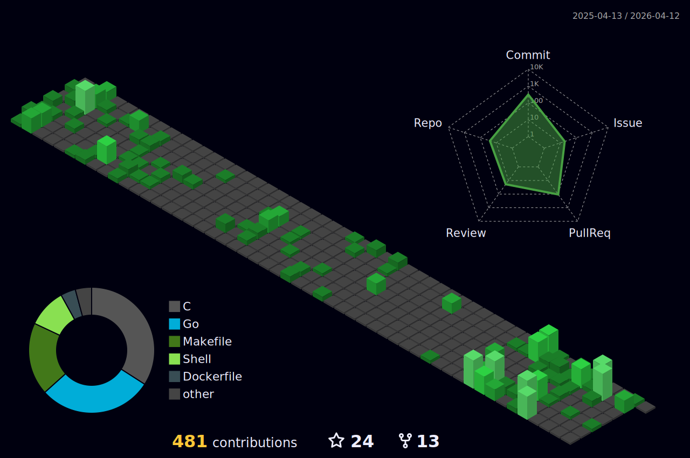

<h2 align="center">Welcome to my profile! :-) </h2>
<h4 align="center">Want to share ideas, collaborate, connect? <a href="https://github.com/maxgio92/maxgio92/discussions/1">Jump here!</a></h4>

# About me

	

# Metrics

	

# Views

> Daily views on repositories.

# Contributions

	

> Isometric view of contributions in the last year. Languages pie is based on recent commits.
