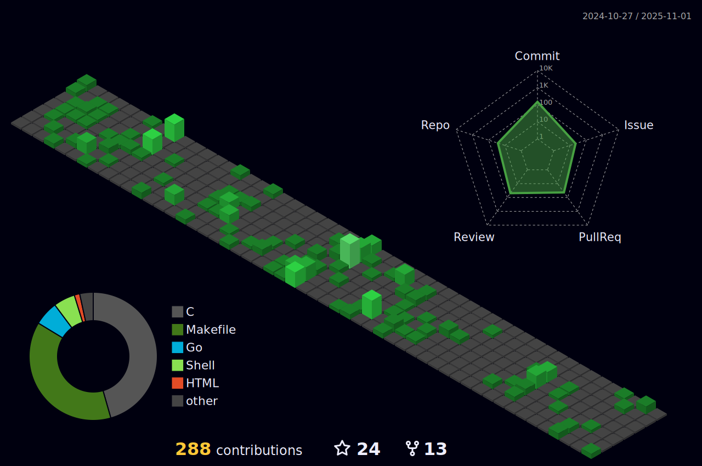

<!---  -->

<h3 align="center">
	Hi there 👋 from maxgio92
</h3>

	

	

	

<h4 align="center">Lines of Code per language in the last year only</h4>

	

<h4 align="center">Views of all repositories (updated daily)</h4>

	

# Languages
<h4 align="center">Most used languages (by number of commits)</h4>

	

# Contributions
<h4 align="center">Isometric view of contributions in the last year. Languages pie is based on recent commits</h4>

	

# Projects

## Full-stack

	

	

	

## Back-end

	

	

## Front-end

	

	

	

	

## Data Science

	

